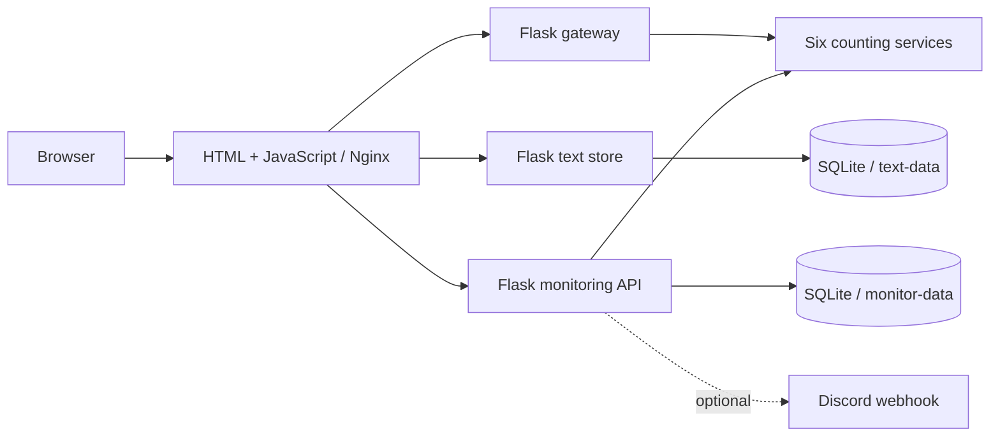

# Containerised Text Processing and Monitoring Platform

A polyglot microservice application that analyses text, saves documents by ID, and monitors service correctness and response time. Built from the **CSC3065 Cloud Computing** coursework at Queen's University Belfast and subsequently repaired and packaged for this portfolio.

**Python · Go · Ruby · Java · Node.js · PHP · Docker · SQLite · GitHub Actions**

[中文说明](docs/README.zh-CN.md) · [API reference](docs/API.md) · [Fixes and validation](docs/REPAIR_REPORT.md) · [Attribution](ATTRIBUTION.md)

## What it does

- Six independent HTTP services count words, characters, English vowels, commas, standalone `and`, and English palindrome words.
- A Flask gateway routes requests from JSON configuration, supports explicit configuration reload, and checks service availability.
- A SQLite service stores text using a caller-supplied ID and rejects duplicates atomically.
- A monitor checks all six services immediately on startup and every minute thereafter, compares results with expected answers, measures the same request's latency, and persists health history.
- Optional Discord webhook notifications cover failed checks and responses exceeding the configured threshold. They are disabled by default.
- An Nginx frontend provides one browser-facing origin; Docker Compose connects backend services by DNS name and retains both databases in named volumes.

## Quick start

Install Docker with Docker Compose v2, then:

```bash
git clone https://github.com/Russwang/text-processing-monitoring-platform.git
cd text-processing-monitoring-platform
cp .env.example .env
docker compose up --build -d
```

Open **http://localhost:8080**. The first build downloads language runtimes and dependencies. To change the browser port, set `FRONTEND_PORT` in `.env`.

```bash
python3 scripts/smoke_test.py          # all six counters, storage and monitoring
# python3 scripts/smoke_test.py http://localhost:8090  # custom port
docker compose logs -f monitor
docker compose down                   # keeps stored data
```

Legacy Docker Compose v1 users can substitute `docker-compose -f compose.yaml` for `docker compose`.

For optional alerts, set `DISCORD_WEBHOOK_URL` in your local `.env`, then recreate the monitor with `docker compose up -d monitor`. Never commit `.env`. Monitoring thresholds and test inputs are in `services/monitor/config.json`.

## Architecture



| Service | Implementation | Container port | Purpose |
|---|---|---:|---|
| frontend | HTML, JavaScript, Nginx | 80 | UI and same-origin API forwarding |
| proxy | Python, Flask | 8000 | Configurable routing, reload, health checks |
| wordcount | PHP | 100 | English word count |
| charcount | Node.js, Express | 90 | JavaScript string length (UTF-16 code units) |
| vowelcount | Python, Flask | 5000 | `a e i o u`, case insensitive |
| commacount | Go | 8080 | ASCII comma count |
| andcount | Ruby, Sinatra | 4567 | Standalone `and`, case insensitive |
| palindromecount | Java | 9000 | Case-insensitive English palindrome words, length ≥ 2 |
| text-store | Python, Flask, SQLite | 4000 | Save and retrieve text by ID |
| monitor | Python, Flask, SQLite | 7000 | Correctness, latency, history, optional alerts |

Only the frontend port is published to the host, bound to localhost. Backend ports are reachable within the Compose network. Browser URLs use `/api/count`, `/api/text` and `/api/monitor`.

## Tests

GitHub Actions has separate Python, Node.js, Go, Ruby and Java jobs, plus a full Docker build and HTTP smoke test. Java uses the standard Maven source layout with JUnit 5 and fails if no tests are discovered.

Local commands (run from the repository root):

```bash
python3 -m venv .venv
source .venv/bin/activate
pip install -r services/monitor/requirements.txt
python -m unittest discover -s tests -p 'test_*.py' -v
python -m unittest discover -s services/vowelcount/src -p 'test.py' -v
node --test tests/frontend.test.js
(cd services/charcount && npm ci && npm test)
(cd services/commacount && go test -v ./...)
(cd services/andcount && bundle install && bundle exec rspec)
(cd services/palindromecount && mvn --batch-mode verify)
docker compose run --rm --no-deps wordcount php /var/www/html/test.php
```

The backend regressions cover upstream timeouts, invalid JSON, error status propagation, config rollback, invalid storage payloads, duplicate IDs, expected-answer checks, deterministic latest health, and disabled/failed webhooks. Frontend tests reproduce request cancellation and late response ordering.

## Project scope and provenance

The course supplied the original frontend, PHP word counter and Node.js character counter. My coursework contribution added the four Python/Go/Ruby/Java counters, gateway, text persistence, monitoring, and frontend improvements. This portfolio adds repairs, reproducible Compose deployment, regression tests, and GitHub Actions. See [ATTRIBUTION.md](ATTRIBUTION.md) for the distinction and AI assistance disclosure.

This is a local demonstration of microservices and monitoring. Multi-cloud deployment, load balancing, automatic failover, authentication, and production availability have not been implemented or measured. The coursework's multi-cloud discussion was a design proposal. Monitoring uses fixed sample cases; it is not exhaustive verification of every possible input. Alerts can repeat once per check, and the sample text store has no document deletion endpoint.

Original assignment documents, private submission materials, local databases, and account secrets are deliberately excluded from the repository.
